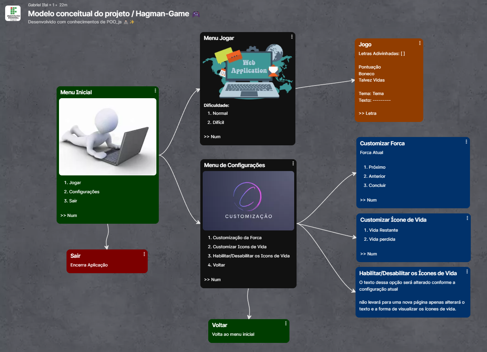

# Jogo da Forca POO 🎮🧑🏻‍💻✨

Projeto de POO realizado para o aperfeiçoamento dos conhecimentos diciplinares em forma de um jogo divertido.

## Sites

- [**Pacote do Projeto**](https://github.com/IanSantosOS/hangman-package-poo)

- [**Projeto no Terminal**](https://github.com/IanSantosOS/hangman-terminal)

- ~~Projeto no Site~~

## Colaboradores 🤝🏽

| Função | Nome | Codenome |
|--------|------|----------|
| Orientador | Ricardo Rubens | RR |
| Aluno | Ian dos Santos | Café |
| Aluno | Gabriel Rodrigues | Ghost |

## Mapa Conceitual e Exemplo Prático 🖼️

